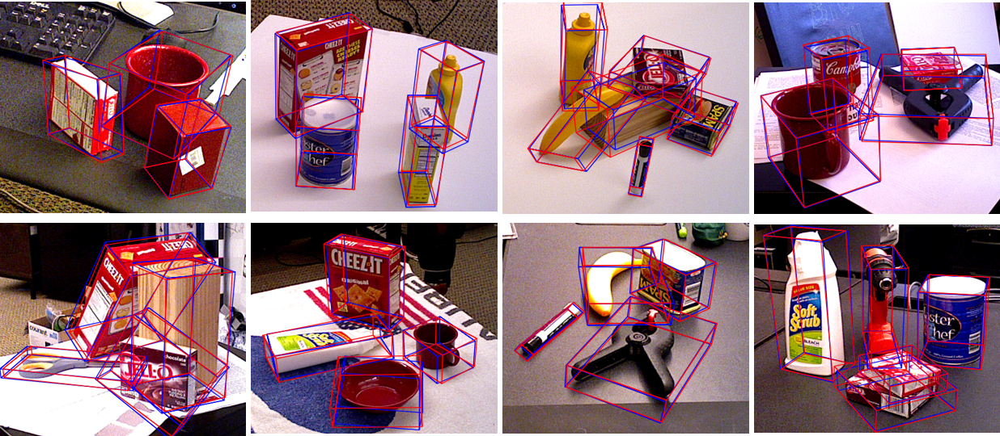

# EP-Net:More efficient pose estimation network with the classification-based keypoints detection

This repository contains a pytorch implementation of "EP-Net:More efficient pose estimation network with the classification-based keypoints detection".

This codebase provides:
- test code
- train code
- dataset process code

# installation
Check [INSTALL.md](INSTALL.md) for installation instructions.
# train
reconfig the config file in E2P/configs/caffe2/keypoints_R_101_FPN.yaml

python E2P/tools/train_net.py
# test
test code in E2P/pose_test

# visualization
- LINEMOD dataset:

- Occ-LINEMOD dataset:

- YCB-Video:
